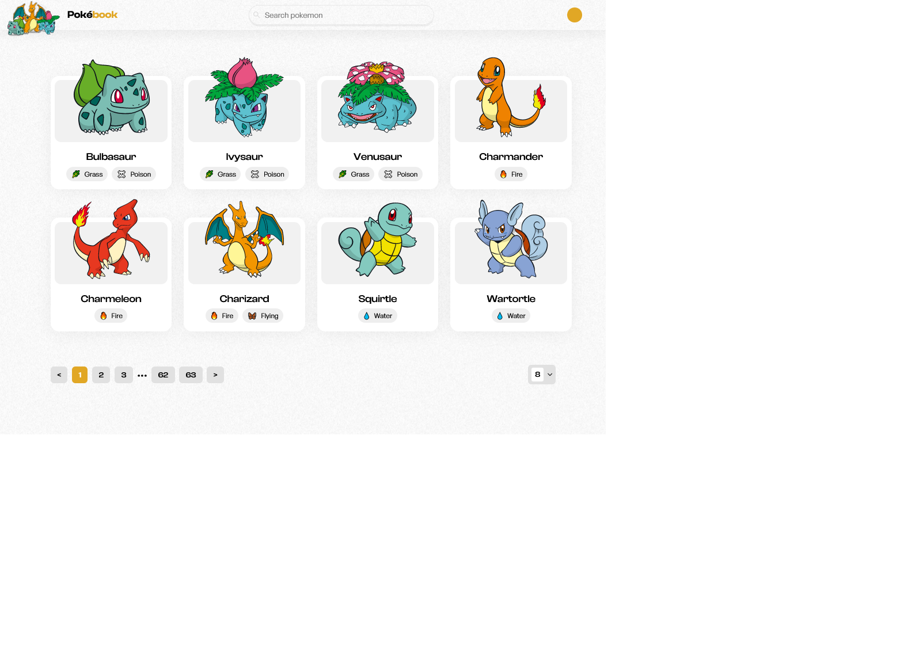

# Pokebook App

[Pokebook](https://pokebookapp.onrender.com/) is a web app that utilizes the PokeAPI to fetch data for various Pokemon. The app offers a user-friendly interface that allows users to view a list of available Pokemon and learn about their stats, abilities, and types.

## Responsive Design and Navigation

Pokebook is fully responsive, allowing users to access it from any device. With pagination and a page size selector, users can easily navigate through a large number of Pokemon without feeling overwhelmed.

## Exciting Features

Pokebook offers unique and exciting features such as identifying Pokemon types, generating dominant colors from each Pokemon sprite, and the ability to switch between tabs to view different details about each Pokemon.

## Customizable Themes and Navigation

Pokebook also includes the ability to change themes with three vibrant theme colors available. With pagination and page size selector features, users can easily navigate through the long list of Pokemon.

## Great User Experience with Search Functionality

To further enhance the user experience, a search functionality is also included. This feature allow users to quickly search for a specific Pokemon by name without having to navigate through the long list of available Pokemon. With this added functionality, users can easily find information about their favorite Pokemon or discover new ones they may be interested in.

## Created as a React Project Challenge

The most exciting thing about Pokebook is the fact that it was created as a React project challenge by me. With my skills and expertise, I was able to create an app that not only provides valuable information about Pokemon, but does so in a way that is both fun and engaging.

Find below other details about the project.

## Screenshots

<details>
<summary>Mobile Screenshot</summary>


</details>

<details>
<summary>Desktop Screenshot</summary>



</details>

## Built with

- React.js
- Styled Components
- Redux Toolkit for state management
- RESTful API from [pokeapi.co](pokeapi.co/docs/v2#pokemon-section)
- Design from Ammiel Yawson

## Project Setup

```sh
clone this repo
```

### Install dependencies

```sh
npm install
```

### Compile and Hot-Reload for Development

```sh
npm run dev
```

### Compile and Minify for Production

```sh
npm run build
```
